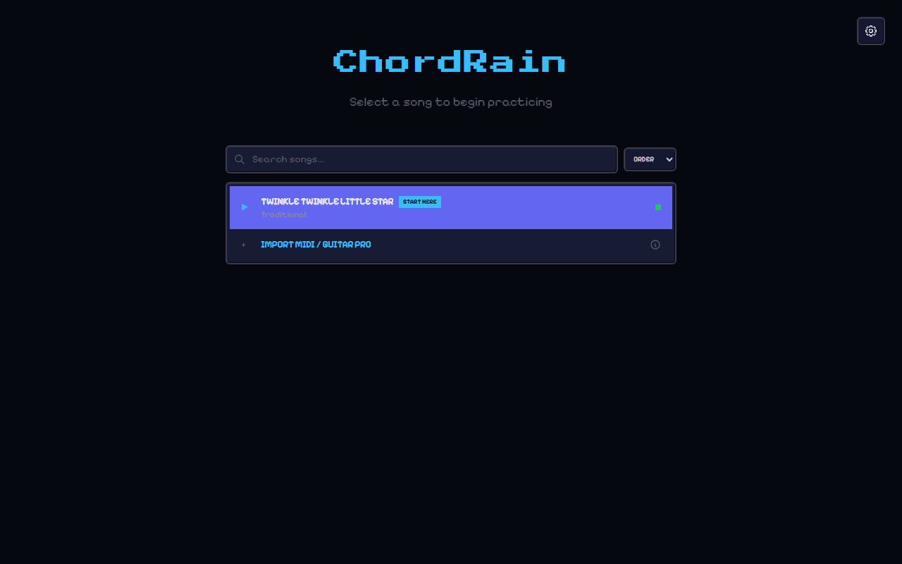
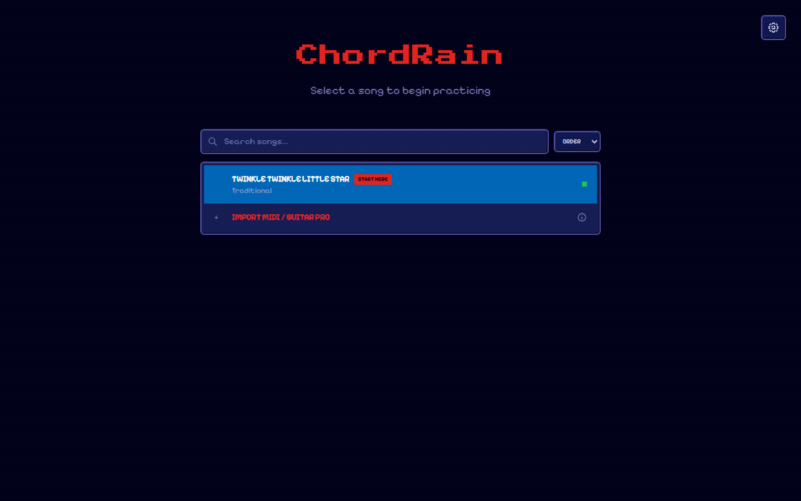
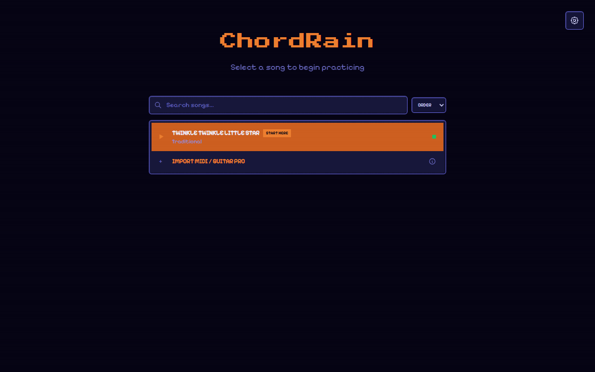
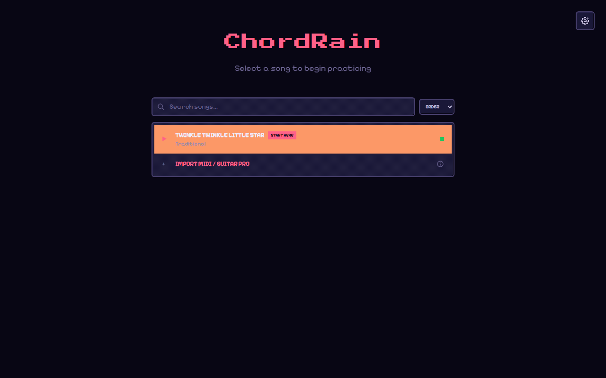
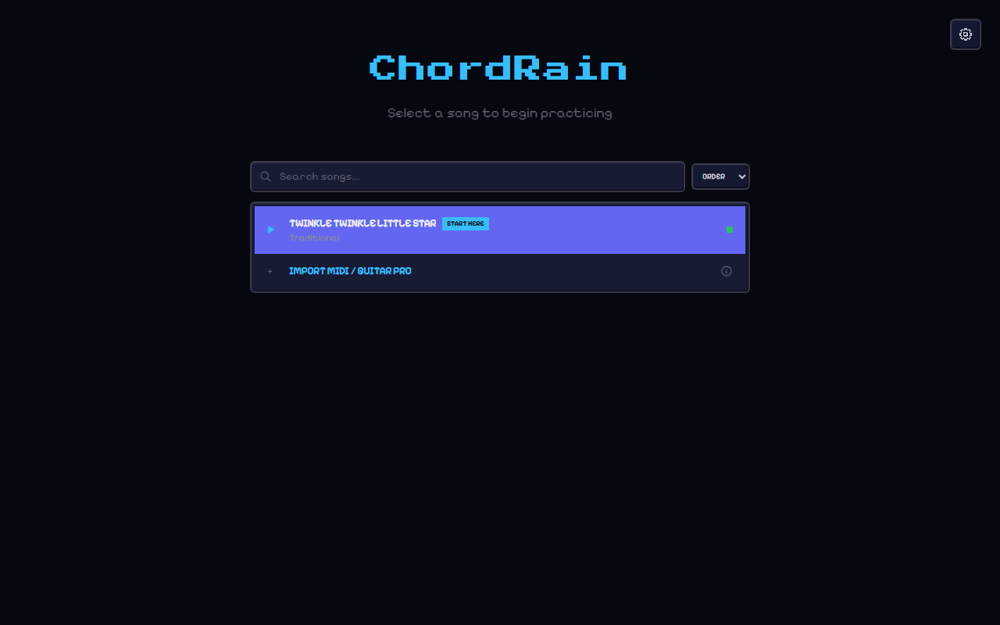
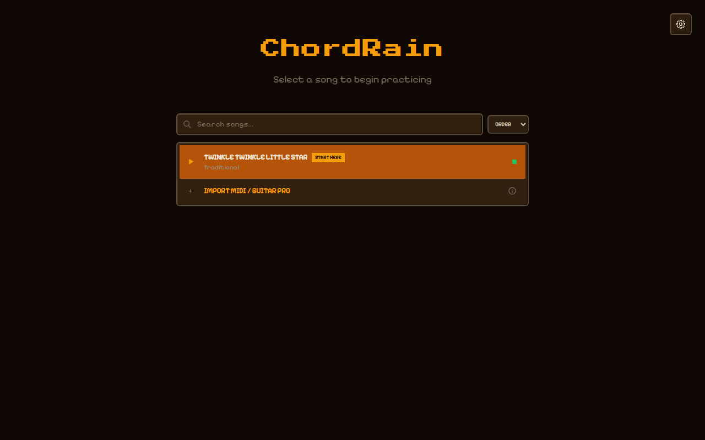
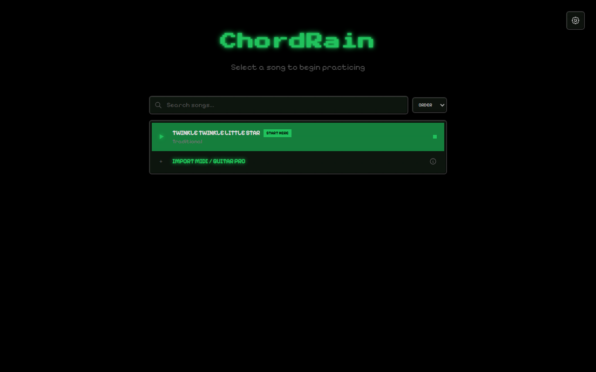

# ChordRain

A Guitar Hero-style interactive guitar trainer built with Next.js and Web Audio.

[**Live Demo**](https://joris-decombe.github.io/ChordRain/)



## Overview

ChordRain helps users learn guitar through a real-time falling-note fretboard visualization. It parses MIDI and Guitar Pro files and renders them as falling notes onto a horizontal 22-fret guitar fretboard, allowing for an intuitive practice experience with real guitar samples.

## Features

- **Waterfall Visualization:** Guitar Hero-style falling notes synchronized with high-quality acoustic guitar audio.
- **Guitar Pro Support:** Load `.gp`, `.gp3`, `.gp4`, `.gp5`, `.gpx` files with full technique data (bends, slides, hammer-ons, pull-offs).
- **MIDI Support:** Upload standard MIDI files with automatic string/fret assignment using hand-movement minimization.
- **6 Pixel Art Themes:** 8-Bit, 16-Bit, Hi-Bit, Cool, Warm, and Mono — each with unique VFX profiles.
- **Canvas VFX Engine:** Particles, glow, bloom, and theme-specific visual effects.
- **Practice Tools:** Speed control (0.5x–2x), loop sections, seek, progress tracking via localStorage.
- **Mobile Ready:** Fullscreen mode, wake lock, PWA hints for iOS, responsive landscape layout.
- **Modern Stack:** Next.js 16, React 19, Tone.js, Tailwind CSS 4.

## Interactive Controls

- **Playback:** Play/Pause with synchronized audio and waterfall.
- **Seeking:** Arrow keys or progress bar for precise navigation.
- **Looping:** Set custom loop points for section practice.
- **Speed:** Adjustable playback rate for difficult passages.
- **Themes:** Cycle through 6 visual themes.
- **Fullscreen:** Immersive distraction-free mode.
- **Keyboard Shortcuts:** Space (play), arrows (seek), Esc (exit).

## Screenshots

### Landing Page
Choose a song or import your own MIDI / Guitar Pro file.


### Themes

| 8-Bit | 16-Bit | Hi-Bit |
|:---:|:---:|:---:|
|  |  |  |

| Cool | Warm | Mono |
|:---:|:---:|:---:|
|  |  |  |

## Getting Started

### Prerequisites

- Node.js (v18+)
- npm

### Installation

```bash
# Clone the repository
git clone https://github.com/joris-decombe/ChordRain.git
cd ChordRain

# Install dependencies
npm install

# Start development server
npm run dev
```

Open [http://localhost:3000/ChordRain](http://localhost:3000/ChordRain) in your browser.

> **Note:** The application uses a `basePath` of `/ChordRain`. All local URLs must include this prefix.

## Development

See [CONTRIBUTING.md](CONTRIBUTING.md) for detailed development instructions.

## Release Process

See [RELEASE.md](RELEASE.md) for versioning and release workflow details.

## Tech Stack

- **Framework:** Next.js 16 (App Router, static export)
- **Audio:** Tone.js & @tonejs/midi
- **Guitar Pro:** @coderline/alphatab
- **Styling:** Tailwind CSS 4
- **Animation:** Framer Motion
- **Testing:** Vitest (Unit) & Playwright (E2E)

## Testing

### Unit Tests

```bash
npm test
```

### End-to-End Tests

```bash
npx playwright test
```

## License

This project is open source under the [MIT License](LICENSE).
